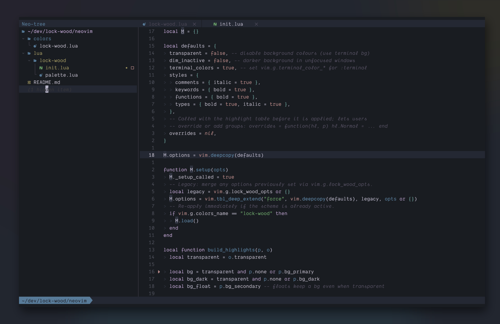

# lock-wood

A muted dark colour scheme for Neovim with broad plugin support.

<p align="center">
  
</p>

## Requirements

- Neovim >= 0.9 (0.10+ recommended for the modern treesitter captures)
- A terminal with true colour support

## Installation

### lazy.nvim

```lua
{
  "lock-wood/neovim",
  lazy = false,
  priority = 1000,
  config = function()
    require("lock-wood").setup({
      -- see options below
    })
    vim.cmd.colorscheme("lock-wood")
  end,
}
```

### Without a plugin manager

Add the repo to your runtimepath, then:

```vim
colorscheme lock-wood
```

## Options

Defaults shown:

```lua
require("lock-wood").setup({
  transparent = false,     -- no editor background (use terminal bg)
  dim_inactive = false,    -- darker background in unfocused windows
  terminal_colors = true,  -- set colours for the builtin :terminal
  styles = {
    comments = { italic = true },
    keywords = { bold = true },
    functions = { bold = true },
    types = { bold = true, italic = true },
  },
  -- Override or add highlight groups. Either a table:
  --   overrides = { Normal = { bg = "#000000" } }
  -- or a function receiving the highlight table and the palette:
  --   overrides = function(hl, palette)
  --     hl.Comment = { fg = palette.cyan_dark, italic = false }
  --   end
  overrides = nil,
})
```

`setup()` is optional — `:colorscheme lock-wood` works standalone with defaults.
Calling `setup()` after the scheme is active re-applies it.

## Supported plugins

Native UI (floats, popups, diff, spell, quickfix, diagnostics), treesitter and
LSP semantic tokens, plus:

telescope.nvim, nvim-cmp, blink.cmp, gitsigns.nvim, nvim-tree, neo-tree,
oil.nvim, which-key.nvim, lazy.nvim, mason.nvim, indent-blankline.nvim,
mini.nvim (statusline, pick, files, diff, indentscope, cursorword, jump),
nvim-notify, noice.nvim, trouble.nvim, flash.nvim, leap.nvim, hop.nvim,
vim-illuminate, nvim-treesitter-context, rainbow-delimiters.nvim,
bufferline.nvim, dashboard-nvim, alpha-nvim, snacks.nvim (dashboard),
diffview.nvim, vim-fugitive.

## Palette

All colours are defined in `lua/lock-wood/palette.lua`.
